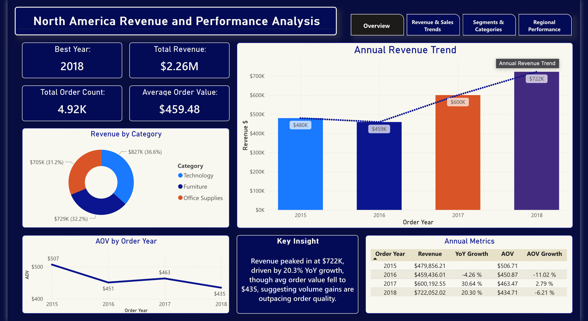
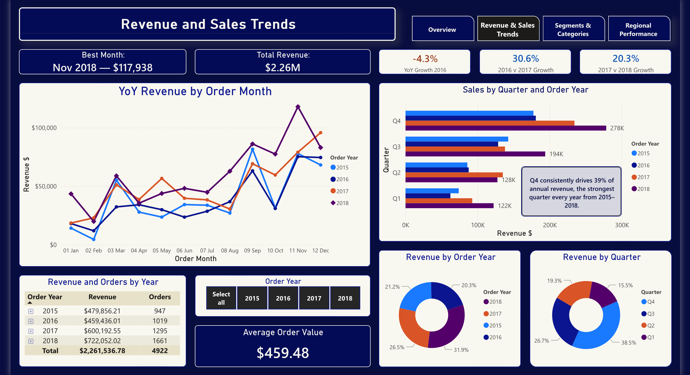
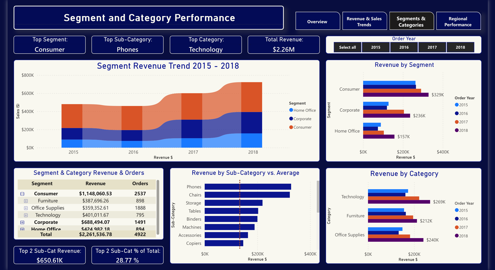
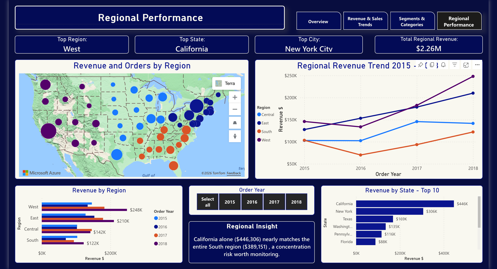

# Power BI Superstore Dashboard 2015–2018

This is a Power BI dashboard analyzing 9,800 Superstore transactions (2015–2018). Built in Power BI Service across 4 tabs using DAX measures for YoY growth, AOV trends, conditional formatting, and dynamic insight cards. The analysis identifies a 2016 revenue dip, declining order value despite volume growth, Q4 seasonality, and geographic concentration risk.

## Dashboard Walkthrough
[Watch the video walkthrough →](https://youtu.be/meY-78UYSME)

## Dashboard Preview

## Files
- `Revenue_and_Performance_Dashboard_2015_-_2018.pbix` — Power BI source file
